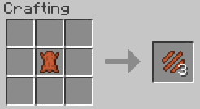
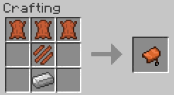

# Leatherworking

An unfinished Minecraft leatherworking mod! Eventual ideas include:

- Leather tanning
- Leather dying
- Non-animal leather sources
- Replacing leather drops with hide drops
- Shark / fish leather
- More leather items (armor, sandals!)
- Cork items

## Items

### Leather strip
Currently only used for creating saddles.

### Water skin
An early game water bucket (with a terrible texture).

### Saddle
Vanilla saddle, just craftable now

## Blocks
A cork log is in the mod, but does not yet generate any trees. The cork tree will eventually be a non-animal source for leather.

